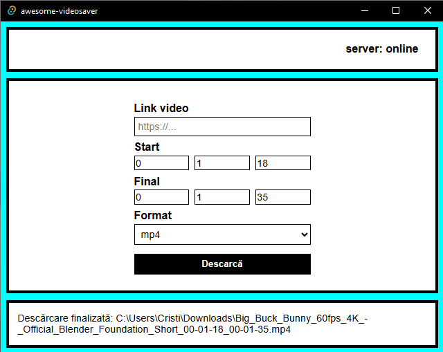
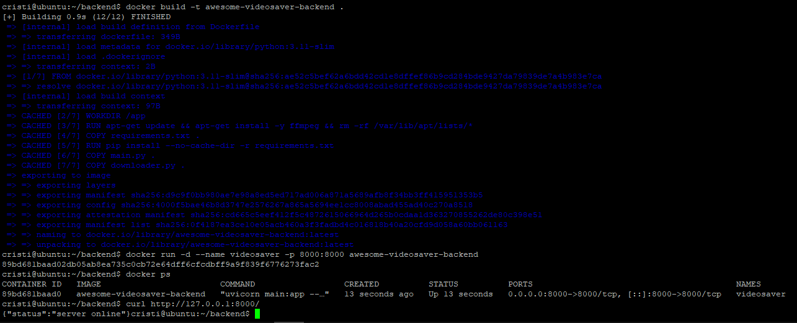

````markdown
# awesome-videosaver

Aplicație desktop client-server pentru descărcarea și tăierea unor secvențe video.

Clientul este realizat cu **React + Tauri**, iar serverul este realizat în **Python + FastAPI**. Serverul rulează pe o mașină Ubuntu, într-un container Docker, și folosește `yt-dlp` pentru descărcarea videoclipului și `ffmpeg` pentru tăierea intervalului ales.

---

## Capturi de ecran

### Interfața aplicației desktop



### Serverul rulat în Docker pe Ubuntu



---

## Ideea aplicației

Aplicația este împărțită în două părți:

```text
Client React/Tauri  ->  Server FastAPI  ->  yt-dlp + ffmpeg
````

Clientul oferă interfața grafică. Utilizatorul introduce linkul videoclipului, timpul de început, timpul de final și formatul dorit.

Serverul primește cererea, descarcă videoclipul, taie intervalul cerut și trimite fișierul rezultat înapoi către client. Clientul salvează apoi fișierul local, în folderul Downloads.

---

## Funcționalități

* introducere link video;
* alegere timp de început și timp de final;
* alegere format: `mp4` sau `mp3`;
* verificare status server: online/offline;
* descărcare video pe server;
* tăiere secvență video cu `ffmpeg`;
* trimiterea fișierului rezultat către client;
* salvarea fișierului pe calculatorul clientului.

---

## Tehnologii folosite

* React
* Tauri
* Python
* FastAPI
* Uvicorn
* Docker
* Ubuntu Server
* yt-dlp
* ffmpeg
* Tailscale

---

## Cum funcționează clientul

Clientul este aplicația desktop realizată cu React și Tauri. În interfață, utilizatorul introduce datele necesare pentru descărcare.

Clientul verifică periodic dacă serverul este online printr-o cerere HTTP de tip `GET`.

```text
GET /
```

Pentru descărcare, clientul trimite către server o cerere HTTP de tip `POST`.

```text
POST /download
```

Datele sunt trimise în format JSON:

```json
{
  "url": "link_video",
  "start": "00:00:58",
  "end": "00:01:12",
  "format": "mp4"
}
```

---

## Cum funcționează serverul

Serverul este realizat în Python, folosind FastAPI.

FastAPI definește endpoint-urile HTTP ale aplicației. Uvicorn pornește efectiv serverul și ascultă cereri pe portul `8000`.

Serverul are două endpoint-uri principale:

```text
GET /
```

Această rută verifică dacă serverul este online.

```text
POST /download
```

Această rută primește datele de la client, descarcă videoclipul, taie intervalul cerut și returnează fișierul rezultat.

Flow-ul serverului este:

```text
primește cererea -> descarcă videoclipul -> taie intervalul -> returnează fișierul
```

Pentru descărcare se folosește:

```text
yt-dlp
```

Pentru procesare video/audio se folosește:

```text
ffmpeg
```

---

## Server Ubuntu

Serverul rulează pe o mașină Ubuntu. Pe această mașină este instalat Docker, iar backend-ul aplicației rulează într-un container.

Pentru conectare la server se poate folosi SSH:

```bash
ssh cristi@IP_SERVER
```

După conectare, se poate verifica dacă serverul Docker rulează:

```bash
docker ps
```

Dacă containerul este oprit, poate fi pornit cu:

```bash
docker start videosaver
```

---

## Tailscale

Pentru conectarea clientului la server am folosit Tailscale. Tailscale creează o rețea privată între dispozitive, astfel încât serverul Ubuntu poate fi accesat printr-un IP privat de forma `100.x.x.x`.

Tailscale nu schimbă arhitectura aplicației. Aplicația rămâne o aplicație client-server care comunică prin HTTP. Tailscale este folosit doar ca metodă simplă de conectare între client și server.

Instalare Tailscale pe Ubuntu:

```bash
curl -fsSL https://tailscale.com/install.sh | sh
sudo tailscale up
```

Afișarea IP-ului Tailscale:

```bash
tailscale ip -4
```

Clientul folosește apoi acest IP pentru a trimite cereri către server:

```js
const API_URL = "http://IP_TAILSCALE:8000";
```

---

## Dockerizarea serverului

Serverul este dockerizat pentru a putea rula într-un mediu izolat. Docker include în container toate dependențele necesare serverului.

În proiect există un fișier `Dockerfile`. Acesta descrie pașii pentru construirea imaginii Docker:

* pornește de la o imagine Python;
* instalează `ffmpeg`;
* copiază fișierele backend-ului;
* instalează dependențele Python;
* pornește serverul FastAPI cu Uvicorn.

Fișierul `requirements.txt` conține pachetele Python necesare:

```text
fastapi
uvicorn
yt-dlp
```

Construirea imaginii Docker:

```bash
cd backend
docker build -t awesome-videosaver-backend .
```

Pornirea containerului:

```bash
docker run -d --name videosaver -p 8000:8000 awesome-videosaver-backend
```

Prin `-p 8000:8000`, portul `8000` din container este expus pe portul `8000` al mașinii Ubuntu. Astfel, clientul poate comunica cu serverul prin HTTP.

Verificare server:

```bash
curl http://127.0.0.1:8000/
```

Răspuns așteptat:

```json
{"status":"server online"}
```

---

## Comenzi utile Docker

Verificare containere active:

```bash
docker ps
```

Verificare toate containerele:

```bash
docker ps -a
```

Pornire container:

```bash
docker start videosaver
```

Oprire container:

```bash
docker stop videosaver
```

Afișare loguri:

```bash
docker logs videosaver
```

Ștergere container:

```bash
docker rm videosaver
```

Reconstruire server după modificări:

```bash
cd backend
docker stop videosaver
docker rm videosaver
docker build -t awesome-videosaver-backend .
docker run -d --name videosaver -p 8000:8000 awesome-videosaver-backend
```

---

## Rulare client

În directorul principal al proiectului:

```bash
npm install
npm run tauri dev
```

Adresa serverului se setează în client:

```js
const API_URL = "http://IP_SERVER:8000";
```

Dacă serverul rulează corect, aplicația afișează:

```text
server: online
```

---

## Structura proiectului

```text
awesome-videosaver/
│
├── backend/
│   ├── main.py
│   ├── downloader.py
│   ├── requirements.txt
│   └── Dockerfile
│
├── src/
│   └── components/
│       ├── FereastraPrincipala.jsx
│       ├── DownloadForm.jsx
│       ├── DownloadInfo.jsx
│       └── ServerStatus.jsx
│
├── poze/
│   ├── interfata.png
│   └── server.png
│
├── README.md
└── package.json
```

---

## Legătura cu sistemele distribuite

Proiectul este relevant pentru disciplina Rețele și sisteme distribuite deoarece folosește o arhitectură client-server.

Clientul și serverul sunt componente separate. Ele pot rula pe mașini diferite și comunică prin rețea folosind HTTP.

Clientul se ocupă de interfața grafică, iar serverul se ocupă de partea de procesare video. Această separare a responsabilităților este o idee importantă în sistemele distribuite.

---

## Concluzie

Aplicația demonstrează un sistem client-server funcțional. Utilizatorul lucrează cu o aplicație desktop, iar procesarea este făcută pe un server separat, rulat în Docker pe Ubuntu.

Proiectul folosește comunicare HTTP, containerizare, procesare pe server și transfer de fișiere între server și client.

```
```
